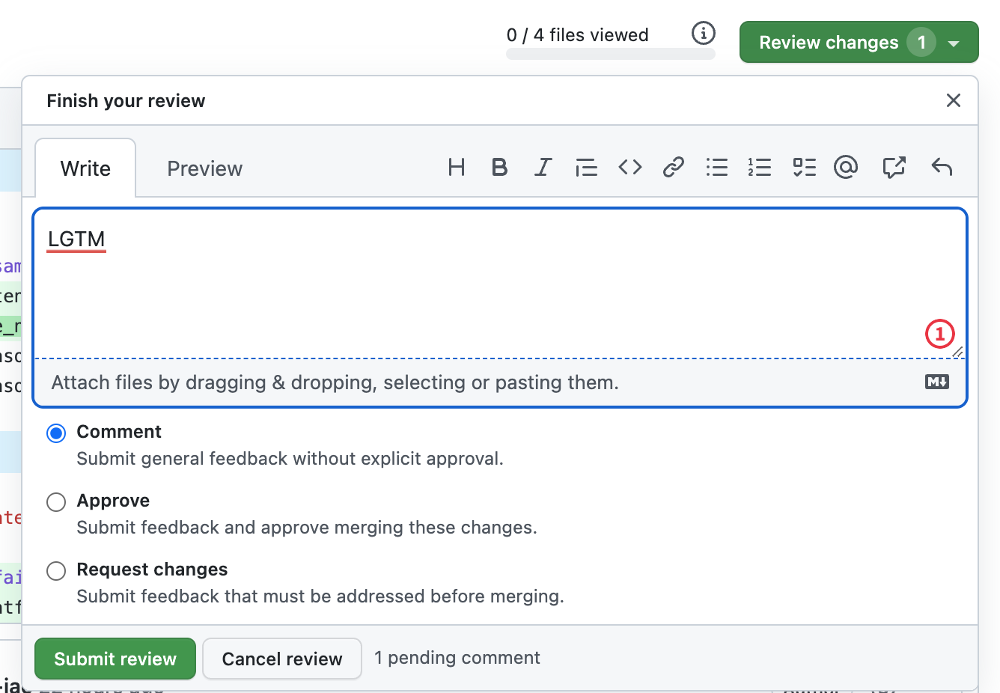
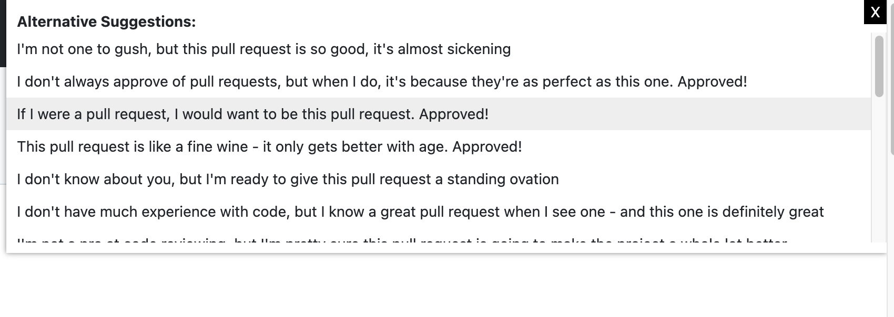

# LGTM Alternative Suggestions

This chrome extension shows alternative suggestions when the text 'LGTM' is entered in a GitHub pull request. I created this because I always feel bad just writing LGTM so wanted to have different options.

## Installation

I've not uploaded this to the chrome web store yet, so you can enable this by doing the following:

- Enable developer mode in Chrome by going to the [chrome://extensions](chrome://extensions) page and clicking on the "Developer mode" checkbox in the top right corner of the page. This will enable additional options for managing and testing your extensions. With developer mode enabled, you will be able to load your extension from a local directory, run it in debug mode, and access other advanced features for developers.
- Click on the "Load unpacked" button and select the directory where you have cloned this extension.
- In `content.js` you can edit the `alternatives` array to add your own custom responses.

Enter LGTM on a pull request:

See suggestions:

Output:

